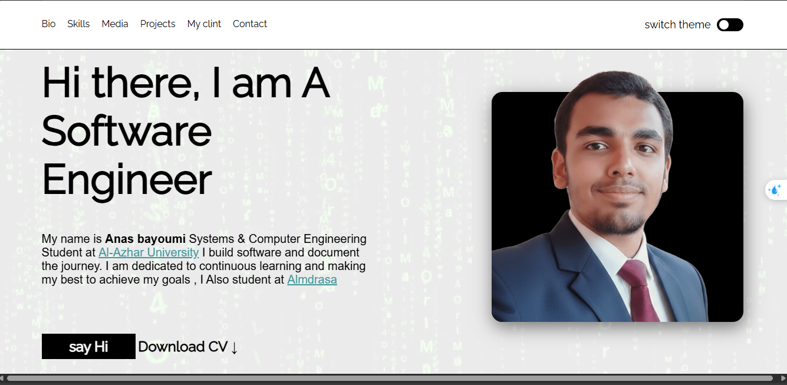

# Frontend Challenge – Responsive Design Project

This is a solution to a Frontend challenge and this is my first front end project.

## 📸 Screenshot

## 🔗 Links

- linkeden URL: [https://www.frontendmentor.io/solutions/your-solution-link](https://www.linkedin.com/in/anas-bayoumi-638474287/?locale=en_US)
- Live Site URL: [https://your-live-site-link.com](https://anasbiomy.github.io/personal-weblite)

## 🛠 Technologies Used

- HTML5
- CSS3
- Flexbox
- CSS Grid
- SASS (SCSS)
- Responsive Design

## 📐 Responsive Design

The layout was built using a **Desktop-first approach** and adapts seamlessly across different screen sizes, including mobile, tablet, and desktop.  
Flexbox and CSS Grid were combined to create a flexible and maintainable layout.

## 📚 What I Learned

Through this project, I improved my understanding of:
- Creating responsive layouts using **CSS Grid** and **Flexbox**
- Writing cleaner and more maintainable styles with **SASS**
- Structuring CSS for scalability
- Building layouts that adapt to different screen sizes

## 🚀 Continued Development

In future projects, I would like to:
- Improve accessibility (ARIA labels, keyboard navigation)
- Optimize performance
- Add animations and transitions for better user experience

## 👤 Author

-  [@Anas bayoumi](https://github.com/Anasbiomy)

